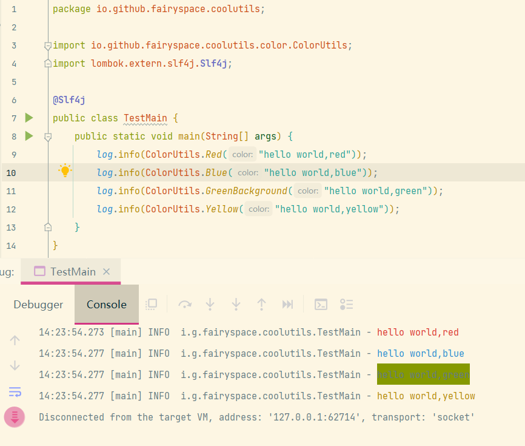

# coolutils

> **方便开发调试的工具类**

> **Tools for easy development or debugging</red>**

怎样使用(how to use)

```xml

<dependency>
    <groupId>io.github.fairyspace</groupId>
    <artifactId>coolutils</artifactId>
    <version>selected version</version>
</dependency>
```

## 目录

* [ColorUtils](#1)
* [ZipUtils](#2)

<h3 id='1'>ColorUtil</h3>

打印输出有颜色的字体。部署到服务器上同样能打印出来。

It can print out colored fonts. Deploying to a server also prints it out.



---
<h3 id='2'>ZipUtil</h3>

- 普通压缩

```java
public class TestMain {
    /*有多级目录时,把每级目录里文件提取到一个文件内,再压缩*/
    static String inputDir = "C:\\test";

    public static void main(String[] args) throws Exception {
        try {
            ZipUtil.toZip(inputDir, "C:\\test\\out.zip");
            //or
            ZipUtil.toZip(inputDir, "C:\\test", "out");
            //or
            ZipUtil.toZip(inputDir, "C:\\test", "out.zip");
            //or
            ZipUtil.toZip(inputDir, "C:\\test\\", "out.zip");
        } catch (IOException e) {
            e.printStackTrace();
        }
    }
}
```

- 保留层次目录的压缩

```java
public class TestMain {
    /*有多级目录时,保留文件目录层次*/
    static String inputDir = "C:\\test";

    public static void main(String[] args) throws Exception {
        try {
            ZipUtil.toZip(inputDir, "C:\\test\\out.zip", true);
        } catch (IOException e) {
            e.printStackTrace();
        }
    }
}
```

- 不同位置文件,url压缩到同一个文件

```java
public class TestMain {
    static String outputZip = "C:\\out.zip";

    public static void main(String[] args) throws Exception {
        String spec1 = "https://cdn.midjourney.com/2c9c653d-f8ca-4ed1-8a92-656cc3770d1e/grid_0_128_N.webp";
        URL url1 = new URL(spec1);
        String spec2 = "https://cdn.midjourney.com/4690fc2f-8e5f-4b8e-b328-9dfac8ab9c1a/grid_0_128_N.webp";
        URL url2 = new URL(spec2);
        File file1 = new File("C:\\test1.txt");
        List<Object> zipfiles = new ArrayList<>();
        zipfiles.add(url1);
        zipfiles.add(url2);
        zipfiles.add(file1);
        ZipUtil.toZip(zipfiles,outputZip);
    }
}
```

- 解压文件
```java
public class TestMain {
    public static void main(String[] args) throws Exception {
        ZipUtil.unZip("C:\\hello.zip","C:\\out");
    }

}
```


